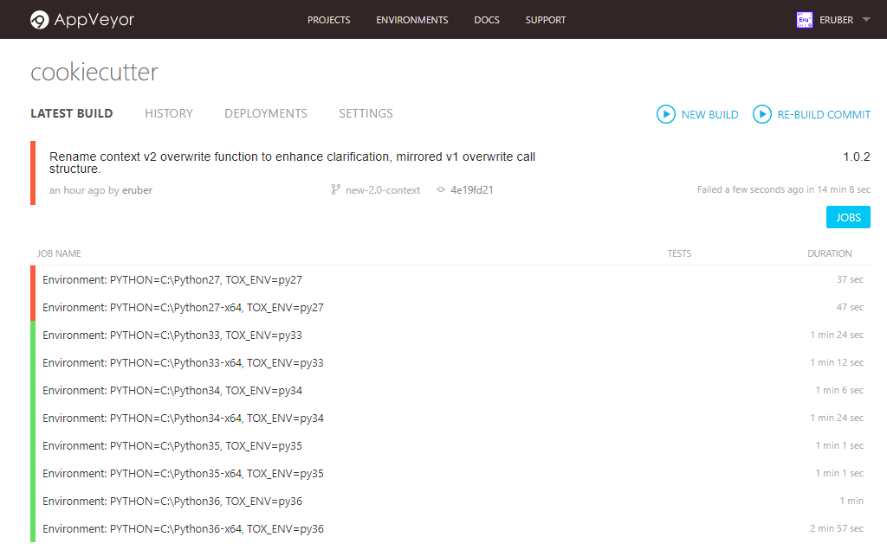

.. ###########################################################################
   This file contains reStructuredText, please do not edit it unless you are
   familar with reStructuredText markup as well as Sphinx specific markup.

   For information regarding reStructuredText markup see
      http://sphinx.pocoo.org/rest.html

   For information regarding Sphinx specific markup see
      http://sphinx.pocoo.org/markup/index.html

.. ########################## SECTION HEADING REMINDER #######################
   # with overline, for parts
   * with overline, for chapters
   =, for sections
   -, for subsections
   ^, for subsubsections
   ", for paragraphs

.. ---------------------------------------------------------------------------

******************
CI AppVeyor Status
******************
The AppVeyor screen shot below illustrates the current status of the project
measured against the official **Cookiecutter Contributor Guidelines**:

   * Support for Python versions 3.6, 3.5, 3.4, 3.3 (both 32 & 64 bit)
   * **Not supporting** Python 2.7

For the latest up-to-date Travis status see `Cookiecutter v2 @ AppVeyor`_ .

.. _Cookiecutter v2 @ AppVeyor: https://ci.appveyor.com/project/eruber/cookiecutter
