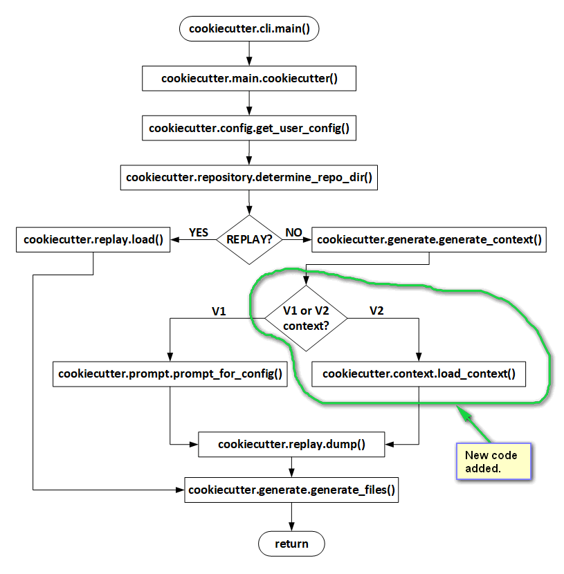
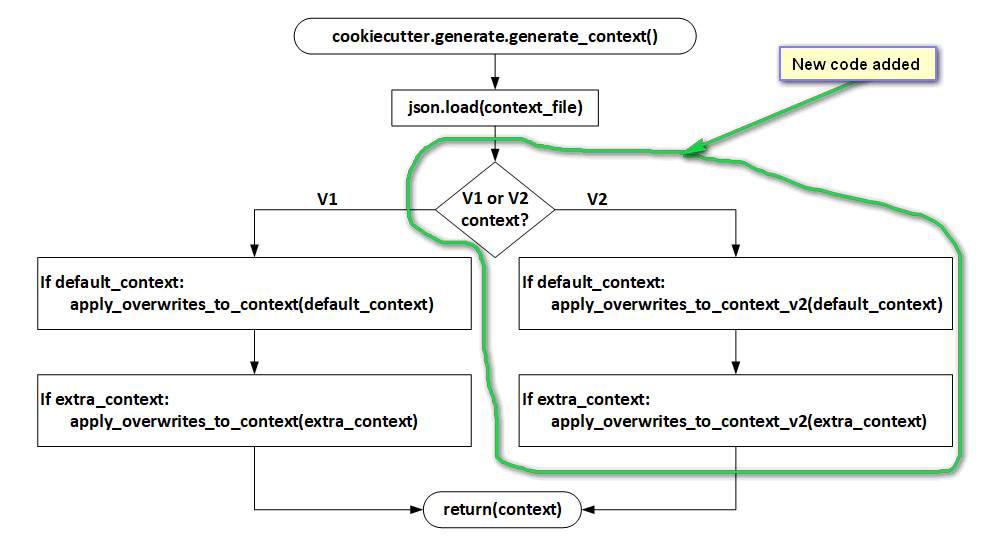

.. ###########################################################################
   This file contains reStructuredText, please do not edit it unless you are
   familar with reStructuredText markup as well as Sphinx specific markup.

   For information regarding reStructuredText markup see
      http://sphinx.pocoo.org/rest.html

   For information regarding Sphinx specific markup see
      http://sphinx.pocoo.org/markup/index.html

.. ########################## SECTION HEADING REMINDER #######################
   # with overline, for parts
   * with overline, for chapters
   =, for sections
   -, for subsections
   ^, for subsubsections
   ", for paragraphs

.. ---------------------------------------------------------------------------

******************
The Implementation
******************
Before implementation began a general survey of the **Cookiecutter v1.6.0** codebase
was performed and a set of implementation goals were developed to help shape any
implementation decisions that might have to be made.

Implementation Goals
====================
The line in the sand here is that **Cookiecutter v1.6.0** is compatible with the
current **cookiecutter.json** context format -- lets call that context version v1;
and **Cookiecutter v2** adds *additional* support for the new **cookiecutter.json**
context format as initially defined by `hackebrot's cookiecutter pull request #848`_ -- lets
call that context v2.

The following goals served to guide the implementation of v2 context support:

1. **Cookiecutter v2.0.0** supports *both* context v1 and context v2 formats.

2. Disturb as little of the existing v1.6.0 codebase as possible - this
   implementation is not a re-write, or re-factoring of the code that is
   already in place for v1.6.0; but a graft of support for v2 context onto
   the v1.6.0 codebase.

3. The **Cookiecutter** user interface does not change.

4. Cookiecutter's external package dependencies do not change.

5. Use the context module code referenced by `hackebrot's cookiecutter pull request #848`_ and
   located in `the new-context-format branch of this hackebrot repo`_.

6. All existing tests for v1 context (**Cookiecutter 1.6.0**) still pass as originally
   written when a v1 context is provided via the **cookiecutter.json** file -- in
   other words, there is *no* contamination of the 1.6.0 codebase by any v2 changes.

7. The new code paths and features implemented that support context v2 have
   tests that follow the testing structure already defined for v1.6.0; and of
   course, these new tests achieve 100% code coverage of any new code paths.

Implementation Overview
=======================
In keeping with **Implementation Goal #2** (disturb little) only two source files
were updated.

The first being **cookiecutter/main.py** as shown in the diagram below:

The second source file updated was **cookiecutter/generate.py** as shown in
the diagram below:

The only new source file added to the project was **cookiecutter/context.py**
which implements the v2 context support. This is the code referenced in
**Implementation Goal #5** above.

The actual repo containing the original version of **context.py** is located
located in `the new-context-format branch of this hackebrot repo`_.

Implementation Statistics
=========================
Comparing statement coverage reports between **Cookiecutter** v1.6.0 and v2.0.0
provides us with some indication of how much code was added to the v1.6.0
codebase (a total of 222 statements) ::

                                  v1.6.0  v2.0.0   Delta   Delta
      File Name                    Stmts   Stmts   Stmts     %      Notes
   ---------------------------------------------------------------------------
   cookiecutter\__init__.py          2       2       0       0% <-- version bump
   cookiecutter\__main__.py          3       3       0
   cookiecutter\cli.py              49      49       0
   cookiecutter\config.py           51      51       0
   cookiecutter\context.py           -     163    +163    +100% <-- v2 new context
   cookiecutter\environment.py      21      21       0
   cookiecutter\exceptions.py       24      24       0
   cookiecutter\extensions.py        9       9       0
   cookiecutter\find.py             18      18       0
   cookiecutter\generate.py        166     222     +56   +33.7% <-- v2 overwrites
   cookiecutter\hooks.py            61      61       0
   cookiecutter\log.py              21      21       0
   cookiecutter\main.py             31      34      +3    +9.7% <-- v2 context load
   cookiecutter\prompt.py           90      90       0
   cookiecutter\replay.py           30      30       0
   cookiecutter\repository.py       39      39       0
   cookiecutter\utils.py            50      50       0
   cookiecutter\vcs.py              54      54       0
   cookiecutter\zipfile.py          61      61       0
   ---------------------------------------------------------------------------
                     Stmt Totals   780    1002     222    +28.5%

As you can see from the table above, aside from the version bump, only two
original v1.6.0 files were modified and only one new file was added.

Modified Files
==============
This section provides a bit more detail on what changes were made to
the files modified::

   cookiecutter/__init__.py (version bump no further details given herein)

   cookiecutter/main.py

   cookiecutter/generate.py

cookiecutter/main.py
--------------------
The **cookiecutter/context.py** file contains a function that determines if
a given context is v1 or v2 -- this function is called in **main.py** to
differentiate between processing the original v1 context via a call to
**prompt.prompt_for_config()** or calling **context.load_context()** to
process the new v2 context.

cookiecutter/generate.py
------------------------
The changes made to **cookiecutter/generate.py** all have to do with supporting
default and extra context overwrites for version 2 templates.

Added **generate.apply_default_overwrites_to_context_v2()** to mirror for v2
context what **generate.apply_overwrites_to_context()** does for v1
context.

Also added **generate.apply_overwrites_to_context_v2()** to handle v2
context overwrites via the extra context.

Modifed **generate.generate_context()** to check for v1 or v2 context and
call the previously mentioned v2 overwrite functions.

Overwrite Considerations Regarding 'default' & 'choices' Fields
^^^^^^^^^^^^^^^^^^^^^^^^^^^^^^^^^^^^^^^^^^^^^^^^^^^^^^^^^^^^^^^
When a variable is defined that has both the 'default' and the 'choices' fields,
these two fields influence each other. If one of these fields is updated, but
not the other field, then the other field will be automatically updated by the
overwrite logic.

If both fields are updated, then the 'default' value will be moved to the first
location of the 'choices' field if it exists elsewhere in the list; if default
value is not in the list, it will be added to the first location in the choices
list. The overwrite logic will take care of this even though the **extra context**
choices list does not explicitly specify this behavior.

Special Overwrite Syntax
^^^^^^^^^^^^^^^^^^^^^^^^
A couple of special syntax tokens were introduced in the **extra context**
processing contained in **generate.apply_overwrites_to_context_v2()** that
allow the following overwrite capabilities:

   1. Change 'name' field in a variable
   2. Remove a field from a variable

**Changing the 'name' Field in a Variable**

Because the algorithm chosen to find a variable's dictionary entry in the
variables list of OrderDicts uses the variable's 'name' field; it could not
be used to simultaneously hold a new 'name' field value.

Therefore the following **extra context** dictionary entry snytax was introduced
to allow the 'name' field of a variable to be changed::

   {
      'name': 'CURRENT_VARIABLE_NAME::NEW_VARIABLE_NAME',
   }

The variable's current name is post-fixed with a double colon (::) followed by
the new name of the variable.

So, for example, to change a variable's 'name' field from
'director_credit' to 'producer_credit', would require::

   {
      'name': 'director_credit::producer_credit',
   }

**Removing a Field from a Variable**

It is possible that a previous **extra context** overwrite requires that a
subsequent variable entry be removed.

In order to accomplish this a **remove field token** is used in the
**extra context** as follows::

   {
      'name': 'director_cut',
      'skip_if': '<<REMOVE::FIELD>>',
   }

In the example above, the **extra context** overwrite results in the variable
named 'director_cut' having it's 'skip_if' field removed.

New Files
=========
The only new file added to the implementation is::

   cookiecutter/context.py

cookiecutter/context.py
-----------------------
This file takes care of processing the new v2 context -- the base code in this file was written
by **@hackebrot** and available at `the new-context-format branch of this hackebrot repo`_ and
is referenced and discussed heavily in  `hackebrot's cookiecutter pull request #848`_.

The following features were added to the base code:

   * added support for **float** type since **click.prompt** supports that type
   * added support for **UUID** type since **click.prompt** supports that type
   * added context v2 check function -- used in **main.py** & **generate.py**
   * type checking on context field injection (inbound data from the JSON file)
   * implemented validation of variable's default or user input value
   * added validation flags to allow controlling the validation -- ignoring case, etc
   * added docstring comments to document parameters for classes **Variable** and **CookiecutterTemplate**
   * added docstring comments to document parameters for function **load_context()**
   * insured CLI option `--no-input` also suppresses v2 context user prompts
   * added method **Variable.__str__()** to help with debugging

Implementation TODOs
====================
The following sections attempt to document what additional implementation
features could be realized in the future.

The Cookiecutter Command Line
-----------------------------
Add a dump context option that emits the context variable list, but does not
render any project files.

I actually have implemented this is a stand-alone command line tool, after
implementing it, I realized it would be trivial to just add a flag option to
the cookiecutter CLI to do this. But this was not implemented herein because
it would violate **Implementation Goal #3**.

cookiecutter/context.py
-----------------------
1. Could add a **CookiecutterTemplate.__str__()** that uses the **Variable.__str__()**
   to realize a complete string dump of the **CookecutterTemplate** object for
   debugging. This would be very easy to do.

2. A better specification of what differentiates a v1 context from a v2 context
   should be considered in the future. Right now a v2 context must define
   the following fields::

      name
      cookiecutter_version
      variables

   At the very least, we could verify that 'variables' is a list of **OrderedDict** objects.
   But at the moment, we just check for the existence of the three fields.

3. Perhaps adding a variable field named `include` of type **click.File** that
   specifies a path to a file that can be included/injected into the template.
   Potential file formats supported could be JSON, INI, YAML, `TOML`_, etc. The
   idea here being that the file contents could be loaded (included) in the
   context namespace -- includes should probably be done prior to any of the
   current context processing. This would allow the context namespace to be
   aware of the contents of other configuration files in the project. Of course
   this whole idea borders on making Cookiecutter a compiler of configuration files
   which in and of itself is probably too heavy of a lift.

.. _hackebrot's cookiecutter pull request #848: https://github.com/audreyr/cookiecutter/pull/848
.. _the new-context-format branch of this hackebrot repo: https://github.com/hackebrot/cookiecutter/tree/new-context-format/
.. _TOML: https://github.com/toml-lang/toml
